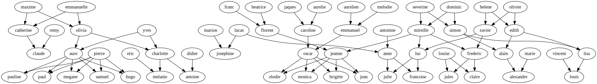

# LOGIQUE-L2
# Eldis YMERAJ- #22015179
# Rodrigo FERREIRA RODRIGUES-#22100697
# M'Hammed Salmân ABIBOU- #21913053
# `TP LOGIQUE` 
---
## 2. Requête et base de connaissances (8 points)
---
### 2.1 Introduction (1 point)
1. D’après ce qui est écrit dans le fichier, c'est vrai que Vincent boit de la vodka.
2. La reponse est `true`.
3.  D’après ce qui est écrit dans le fichier, Otto ne boit pas de la vodka.
4.  La reponse est `false`.
5.  Oui, la réponse a changé--la réponse est `true`.
6.  La réponse de l’interpréteur montre que les personnes qu'ils boivent de l'eau sont **abdoul**, **simon**, **otto**.
7.  L’interpréteur donne tout les boissons que boit **simon**.
8.  `boisson ( X ) : - boit (_ , X ).`

### 2.2 La famille (3 points)
1. `mere(X, Y) :- parent(X, Y), femme(X).`--> quelque soit X, Y : X est un parent d'Y et X est une femme. Ce qui implique que X est mère d'Y.  
`pere(X, Y) :- parent(X, Y), homme(X).`--> quelque soit X, Y : X est un parent d'Y et X est un homme. Ce qui implique que X est père d'Y.  
2. `fils(X, Y) :- homme(X), parent(Y, X).`--> quelque soit X, Y : X est un homme et Y est un parent de X. Ce qui implique que X est le fils d'Y.  
`fille(X, Y) :- femme(X), pere(Y, X).`--> quelque soit X, Y : X est une famme et Y est un parent de X. Ce qui implique que X est la fille d'Y.  
3. `grandpere(X, Y) :- parent(Z,Y), pere(X,Z).`--> quelque soit X, Y, Z : X est le père de Z et Z est un parent de Y. Ce qui implique que X est le grand-père d'Y.   
`grandmere(X, Y) :- parent(Z,Y), mere(X,Z).`--> quelque soit X, Y, Z : X est la mère de Z et Z est un parent de Y. Ce qui implique que X est la grand-mère d'Y.  
4. `soeur(X, Y) :- femme(X), parent(Z, X), parent(Z, Y), X\==Y.`--> quelque soit X, Y, Z : X est une femme, Z est un parent de X, Z est aussi un parent d'Y et X est different d'Y. Ce qui implique que X est la soeur d'Y.  
`frere(X, Y) :- homme(X), parent(Z, X), parent(Z, Y), X\==Y.`--> quelque soit X, Y, Z : X est un homme, Z est un parent de X, Z est aussi un parent d'Y et X est different d'Y. Ce qui implique que X est le frère d'Y.  
5. `cousin(X, Y) :-  homme(X), parent(Z, X), parent(T, Y), frere(Z, T), soeur(T, Z), X\==Y.`-->quelque soit X, Y, Z, T : X est un homme et Z est le parent de X et T est le parent d'Y et Z est le frere de T et T est la soeur de Z d'ou X\==Y implique que X est le cousin d'Y.  
`cousine(X, Y) :- femme(X), parent(Z, X), parent(T, Y), frere(Z, T), soeur(T, Z), X\==Y.`-->quelque soit X, Y, Z, T : X est une femme et Z est le parent de X et T est le parent d'Y et Z est le frere de T et T est la soeur de Z d'ou X\==Y implique que X est la cousine d'Y.  
6. Voici toutes les relations de parenté entre les personnes sous la forme d'un graphe :  
maxime est le **père** de catherine, olivia;  
emmanuelle est la **mère** de catherine, olivia;  
remy est le **père** de claude;  
catherine est la **mère** de claude;  
yves est le **père** de aure et charlotte;  
olivia est la **mère** de aure et charlotte;  
pierre est le **père** de samuel, hugo, pauline, paul et megane;  
aure est la **mère** de samuel, hugo, pauline, paul et megane;  
charlotte est la **mère** de melanie et antoine;  
eric est le **père** de melanie;  
didier est le **père** d'antoine;  
aurelien et melodie sont les **parents** d'emmanuel;  
jaques et aurelie sont les **parents** de caroline;  
franc et beatrice sont les **parents** de florent;  
dominic et severine sont les **parents** de mireille et simon;  
olivier et helene sont les **parents** d'edith et xavier;  
lucas est le **père** d'anne et josephine;  
antonine est la **mère** d'anne;  
marion est la **mère** de josephine;  
xavier et mireille sont les **parents** de luc et frederic;  
simon et edith sont les **parents** de lisa et alain;  
florent et mireille sont les **parents** de jeanne;  
caroline et emmanuel sont les **parents** d'oscar;  
oscar et jeanne sont les **parents** de jean, elodie, monica et brigitte;  
vincent et lisa sont les **parents** de louis;  
alain et marie sonnt les **parents** d'alexandre;  
frederic et louise sont les **parents** de claire et jules;  
luc et anne sont les **parents** de francoise et julie.  

### 2.3 La fin de la solitude (2 points)
1. `personne(1,sam,180,brun,27).`  
`gout(1,rap,action,basket).`  
`recherche(1,167,blonde,27).`  
2. `convient_physiquement(X,Y) :- personne(N, Y, _, _, _), recherche(N,T,C,A), personne(_, X, T,C,A), X\==Y.` --> Quelque soit X, Y, les noms de deux personnes différentes : on récupère le numéro de la personne nommée Y et on s'en sert pour avoir ses goûts. On les compare aux caractéristiques de la personne dont le nom est X. Ce qui se traduit par X *plaît physiquement* à Y.  
`ont_meme_gouts(X,Y) :- gout(N1,M,L,S), gout(N2,M,L,S), personne(N1,X,_,_,_),personne(N2,Y,_,_,_), X\==Y.`
--> Quelque soit X, Y, les noms de deux personnes différentes : on compare les goûts de deux personnes identifiés par leurs numéros, et on s'en sert pour récupérer leur nom. Ainsi, X et Y ont les *mêmes goûts*.  
3. `assortis(X,Y) :- convient_physiquement(X,Y), convient_physiquement(Y,X), ont_meme_gouts(X,Y), X\==Y.` --> Quelque soit X, Y, les noms de deux personnes différentes : on recherche deux personnes X et Y qui ont les mêmes goûts, X plaît physiquement à Y et Y plaît physiquement à X. On dit alors que X et Y sont assortis.  

### 2.4 Attention à ne pas dépasser ! (2 points)
1. On a commencé par instancier les trois couleurs disponibles :  
`couleur(rouge).`  
`couleur(vert).`  
`couleur(jaune).`  
On a alors le prédicat suivant :  
`coloriage(C1,C2,C3,C4) :- couleur(C1), couleur(C2), couleur(C3), couleur(C4), C1\==C2, C1\==C3, C1\==C4, C2\==C3, C3\==C4.`
--> on attribue d'abord à chaque case une couleur et on applique ensuite les contraintes exigées (deux cases contiguës ne peuvent pas avoir la même couleur).  
2.`coloriage(C1,C2,C3,C4) :- couleur(C1),C1\==C2, C1\==C3, C1\==C4, couleur(C2),C2\==C3, couleur(C3), C3\==C4, couleur(C4).`
--> dans ce cas, prolog renvoie toutes les possibilités possibles sans prendre en compte la contrainte de ne pas avoir deux mêmes couleurs à côté.  

---
### 3 Graphes et récursivité (7 points)
---

### 3.1 Introduction (4 points)
1.`fact(0,1).`  
`  fact(N,R) :- N>0, M is N-1, fact(M,T), R is N * T.`  
--> Ce prédicat calcule **la factorielle de N**. Ici, R est la variable qui acceuille le résultat de N!. Notre cran d'arrêt est 0!=1. Pour tout N>0, on obtient le résultat de façon récursive.  
2.`somme(0,0).`  
`  somme(N,R) :- N > 0 , N1 is N-1 , somme(N1,R1) ,R is N+R1.`  
--> Ce prédicat calcule **la somme des entiers jusqu'à N**. Ici, R est la variable qui acceuille le résultat de cette somme. Notre cran d'arrêt est 0. Pour tout N>0, on obtient le résultat de façon récursive.  
3.`fib(1,1).`  
`  fib(2,1).`  
`  fib(N,R):- N>2, N1 is N-1, N2 is N-2, fib(N1,R1), fib(N2,R2), R is R1+R2.`  
--> Ce prédicat calcule **F(n)** avec F étant la suite de fibonacci. Ici, R est la variable qui acceuille le résultat. Notre cran d'arrêt est F(1)=F(2)=1. Pour tout N>0, on obtient le résultat de façon récursive.  
4.`ackermann(0, N, A) :- A is N +1.`  
`  ackermann(M, 0, A) :- M > 0, M2 is M-1, ackermann(M2, 1, A).`  
`  ackermann(M, N, A) :- M > 0, N > 0, M2 is M - 1, N2 is N-1, ackermann(M,N2,A1), ackermann(M2,A1,A).`  
--> Ce prédicat calcule **A(m,n)** avec A étant la fonction d'Ackermann et n,m deux entiers positifs. Ici, R est la variable qui acceuille le résultat. Notre cran d'arrêt est : si m=0, A(m,n)=n+1. Pour tout N>0 et M>0, on obtient le résultat de façon récursive.  

### 3.2 Graphes dirigés acycliques (3 points)
1.`chemin_oriente(X,X) :- sommet(X).`  
`  chemin_oriente(X,Y) :- arete(X,Y).`  
`  chemin_oriente(X,Y) :- chemin_oriente(X,Z), arete(Z,Y).`  
--> X et Y correspondent à deux points. On cherche à savoir s'il existe un chemin orienté entre eux. Pour cela, on regarde s'il existe une arête allant de X à Y ou alors si X=Y on regarde si X est un sommet, si ce n'est pas le cas on vérifie s'il existe des points intermédiaires, représentés ici par la variable Z, tel que X va à Z et Z va à Y.  
2.`chemin_orienteN(X,X) :- sommet(X).`  
`  chemin_orienteN(X,Y,1) :- arete(X,Y).`  
`  chemin_orienteN(X, Y, N):-chemin_orienteN(X, Z, M), N is M+1, arete(Z,Y).`  
--> on a le même principe que la question d'avant hormis qu'ici on cherche à savoir la longueur du chemin, stockée dans la variable N. Si X va directement à Y alors N=1, sinon à chaque point intermédiaire on incréméente N de 1. Dans le cas où X=Y, alors on regarde si X est un sommet. La taille du chemin sera alors de 0. Si jamais il n'existe aucun chemin orienté allant de X à Y alors N=0.   
3.`chemin(X,X):- sommet(X).`  
`  chemin(X,Y) :- arete(X,Y).`  
`  chemin(X,Y) :- arete(Y,X).`  
`  chemin(X,Y) :- chemin(X,Z), arete(Z,Y).`  
-->  ici, l'orientation n'importe pas. On cherche juste à savoir si deux points sont reliés, directement ou à travers d'autres points.  

---
### 4 Listes et langages (17 points)
---

### 4.1 Introduction (1 point)
1. La réponse est :  
X = a,  
Y = [b, c, d].  
2. Le programme renvoie **false**. Cela s'explique par le fait que la liste contienne plusieurs éléments.  

### 4.2 Opérations sur les listes (5 points)
1.`head(X,L):- [X|_]=L.` --> on renvoie le premier élément de la liste **L**.
2.`addhead(X,L,L1):- L1=[X|L].` --> on rajoute au début de la liste **L**, la variable X. Cela nous donne une nouvelle liste **L1**.
3.`last1(X,[L]):- X=L.`  
`last1(X,[_|L]):- last1(X,L).`   
--> on cherche à renvoyer le dernier élément d'une liste. Pour cela, on procède de manière récursive. On appelle à nouveau le prédicat mais cette fois juste avec le corps de la liste, et ce jusqu'à ce que la liste ne possède qu'un seul élément, que l'on renvoie.  
4.`addlast(X , [] , [ X ]).`  
`addlast(X ,[ T | Q ], [T | Q1]) :- addlast(X, Q, Q1).`  
--> on cherche à ajouter un élément X à la fin d'une liste. Pour cela, on procède encore une fois de façon récursive.  
5.`reverse1([],[]).`  
`reverse1([X|R],L1):-reverse(R,R1),append(R1,[X],L1).`  
--> On cherche à retourner une liste donné à l'ordre inverse. Pour cela on a utilisé la fonction append qui permet d'ajouter des éléments d'une liste dans une autre.  

### 4.3 Construction inductive et langages (11pt)
1. **a^n^ b, n dans N** :   
`langage1([b]).`   
`langage1([a|S]):-langage1(S).`  
Base : `b` est un mot du code   
Induction: Si `S` est dans code alors `aS` est un mot du code.  
2. **ab^n^, n dans N** :  
`langage2([a]).`   
`langage2(S1):-addlast(b,S,S1), langage2(S).`  
Base: `a` est un mot du code.  
Induction: Si `S` est dans code alors `Sb` est un mot du code.  
3. **a^n^ b^m^ et n,m dans N** :  
`langage3([]).`  
`langage3([a|S]):-langage3(S).`  
`langage3(S1):-addlast(b,S,S1), langage3(S).`  
Base: Le mot vide est un mot du code.   
Induction: Si `S` est dans code alors `Sb` est un mot du code,  
Si `S` est dans code alors `aS` est un mot du code.  
4. **a^2n^, n dans N** :  
`langage4([]).`  
`langage4([a|S1]) :- addhead(a,S,S1), langage4(S).`  
Base: Le mot vide est un mot du code.  
Induction: Si `S` est dans code alors `aaS` est dans le code.  
5. **a^n^ b^n^, n dans N** :  
`langage5([]).`  
`langage5(S2) :- addhead(a,S1,S2), addlast(b,S,S1),langage5(S).`  
Base: Le mot vide est un mot du code.  
Induction: Si `S` est dans code alors `aSb` est dans le code.  
6. **Les palindromes** :   
`palindrome([]).`  
`palindrome([a]).`  
`palindrome([b]).`  
`palindrome(S2) :- addhead(a,S1,S2), addlast(a,S,S1),palindrome(S).`  
`palindrome(S2) :- addhead(b,S1,S2), addlast(b,S,S1),palindrome(S).`   
Base: Le mot vide, a, b sont dans le code.  
Induction: Si `S` est dans le code alors `aSa` est dans le code,  
Si `S` est dans code alors `bSb` est dans code.   
7. **a^l^ b^m^ c^n^ et l,b,m dans N** :  
`langage7([]).`   
`langage7([b]).`   
`langage7(S1):-addlast(c,S,S1), langage7(S).`  
`langage7(S1):-addhead(a,S,S1), langage7(S).`  
`langage7([b|S1]):-addhead(b,S,S1),langage7(S).`   
`langage7(S2):-addlast(b,S1,S2), addlast(b,S,S1),langage7(S).`  
Base: Le mot vide est dans le code.  
Induction: Si `S` est dans code alors `aS` est dans le code,  
Si `S` est dans le code alors `Sc` est dans le code,  
Si `S` est dans le code et termine par b alors `Sb` est dans code,  
Si `S` est dans le code et commence par b alors `bS` est dans code,   
Si `S` est le mot vide alors `bS` est dans code.  
8. **a^m^ b^n^ c^m^ et m,n dans N** :   
`langage8([]).`   
`langage8([b]).`  
`langage8(S2):-addlast(c,S1,S2), addhead(a,S,S1), langage8(S).`  
`langage8([b|S1]):-addhead(b,S,S1),langage8(S).`   
`langage8(S2):-addlast(b,S1,S2), addlast(b,S,S1),langage8(S).`  
Base: Le mot vide est dans le code.  
Induction: Si `S` est dans le code alors `aSc` est dans le code,  
Si `S` est dans le code et termine par b alors `Sb` est dans le code,   
Si `S` est dans le code et commence par b alors `bS` est dans le code,  
Si `S` est le mot vide alors `bS` est dans code.   
9. **Tous les monts sur {a,b} contenant au plus un b** :  
`langage9([]).`   
`langage9([b]).`   
`langage9([a|S]):-langage9(S).`  
`langage9(S1):-addlast(a,S,S1), langage9(S).`  
Base: Le mot vide est dans le code.   
Induction: Si `S` est dans le code alors `aS` est dans le code,   
Si `S` est dans le code alors `Sa` est dans le code,  
Si `S` est dans  le code et ne contient aucun b alors `bS` est dans le code,  
Si `S` est dans le code et ne contient aucun b alors `Sb` est dans le code.   
10. **Tous les mots ayant le même nombre de a et de b** :   
`count(L,E,N):- include(=(E),L,L2), length(L2,N).`    
--> Cette fonction **count** calcule le nombre de récurrences N d'un élément E dans une liste L. **include** filtre le contenu de L de sorte que dans L2 il n'y a plus que des récurrences de E, on calcule ensuite la taille de L2 grâce à lenght.  
`langage10(S) :- count(S,a,N), count(S,b,N2), N==N2.`    
--> on compte le nombre de a et de b dans le mot. Si le nombre est le même alors le mot appartient au langage.  

---
## -------------------------------------------------------FIN DE TP------------------------------------------------------
---
